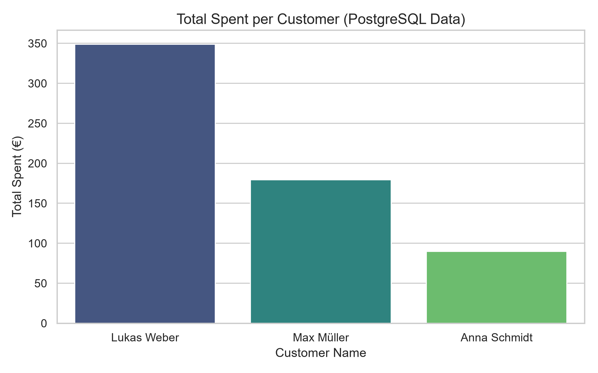

# E-Commerce CRM Analysis (PostgreSQL & Python)

A data analytics project integrating a PostgreSQL database with Python to analyze customer behavior and purchasing patterns for an e-commerce CRM platform.

##  Project Overview
- **Database:** PostgreSQL (Relational schema with primary & foreign key constraints)
- **Database Management Tool:** pgAdmin 4
- **Python Libraries:** `psycopg2`, `pandas`, `matplotlib`, `seaborn`
- **Key Focus:** SQL Joins, Aggregations, Data Extraction & Visualization

##  Database Structure
The project utilizes two relational tables:
1. `customers` (customer_id, first_name, last_name, email, city)
2. `orders` (order_id, customer_id, order_date, amount)

##  Sample SQL Analysis
```sql
-- Customer Spending Aggregation
SELECT 
    c.first_name || ' ' || c.last_name AS full_name,
    c.city,
    COUNT(o.order_id) AS total_orders,
    SUM(o.amount) AS total_spent
FROM customers c
INNER JOIN orders o ON c.customer_id = o.customer_id
GROUP BY c.customer_id, c.first_name, c.last_name, c.city
ORDER BY total_spent DESC;
```
##  Visual Output


##  How to Run
1. Clone the repository:
```bash
git clone https://github.com/mohamadaskari/PostgreSQL-CRM-Analysis.git
```
2.Install dependencies:
```bash
pip install psycopg2-binary pandas matplotlib seaborn
```
Update database credentials in postgres_analysis.py.
3.Run the script:
```bash
python postgres_analysis.py
```

1. Clone the repository:
```bash
